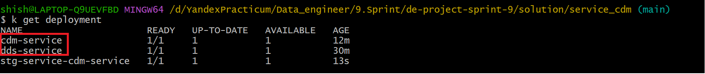
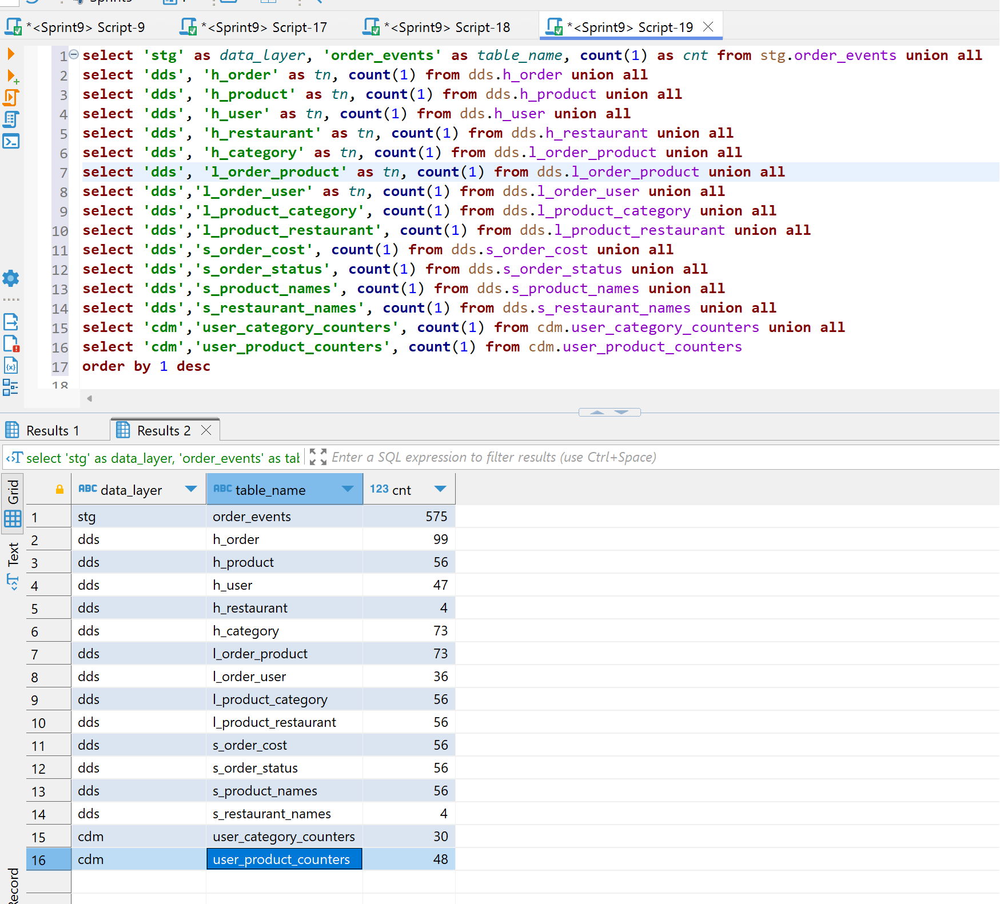

### Результат работы, самопроверка
Все сервисы работают как локально в docker-compose, так и в кубере в yandex cloud.

### Ссылка на container registry
  - dds-service: cr.yandex/crp6l1lep170l7db7l4c/dds_service:v2025-02-09-r1
  - cdm-service: cr.yandex/crp6l1lep170l7db7l4c/cdm_service:v2025-02-09-r1

### Ссылка на dashboard в DataLens
https://datalens.yandex.cloud/nj1pra7svcke9-itogovyy-dashbord?state=3d82629f56

### Скрины

